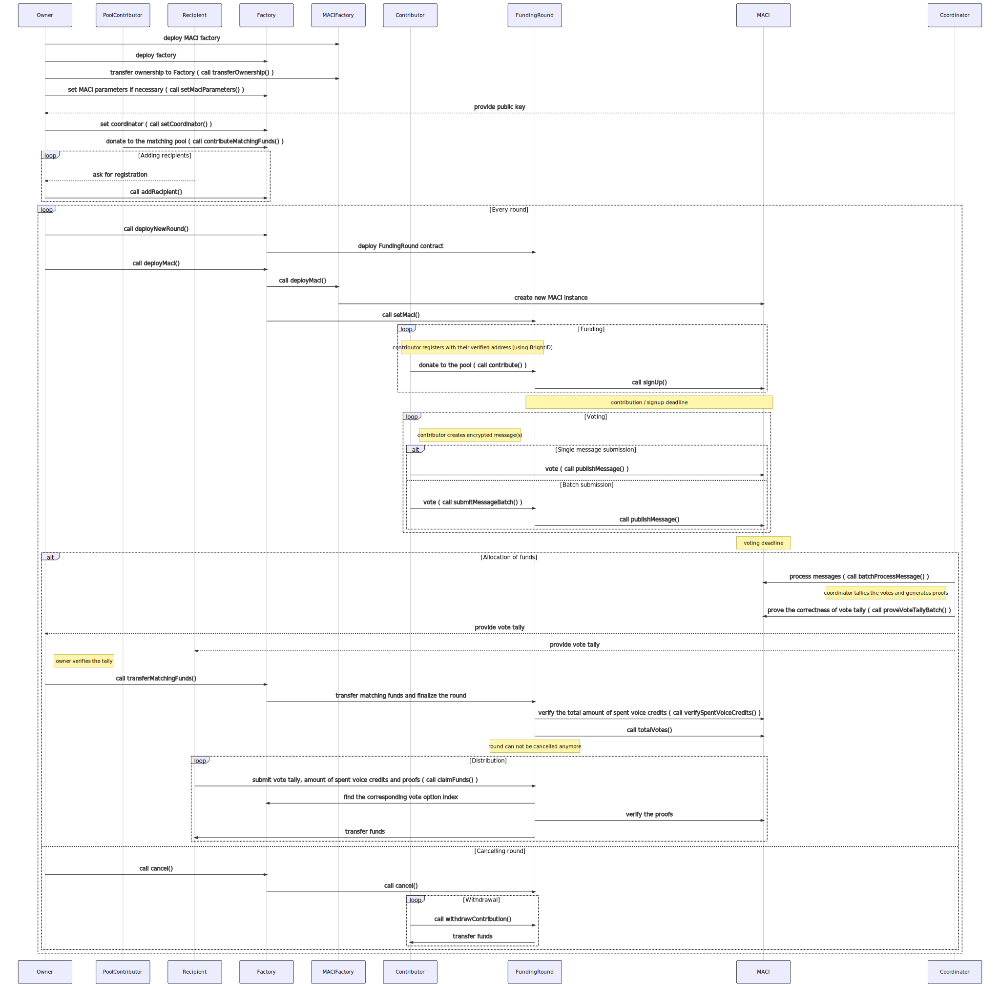

# clr.fund

clr.fund is a permissionless and trust-minimized [Quadratic Funding](https://wtfisqf.com/) application for Ethereum Public Goods. It uses [BrightID](https://brightID.org) for [Sybil](https://en.wikipedia.org/wiki/Sybil_attack) resistance and Minimal Anti-Collusion Infrastructure ([MACI](https://github.com/appliedzkp/maci)) to protect against various forms of bribery and collusion with the use of [zk-SNARKs](https://academy.binance.com/en/articles/zk-snarks-and-zk-starks-explained).

clr.fund runs a continuous sequence of Quadratic Funding rounds, where anyone is able to add public goods projects as funding "recipients", contribute funds to the matching pool ("matching funds"), and contribute funds to individual recipients.

While clr.fund aims to be agnostic to the source of matching funds, it specifically aims to enable contributions from the following sources:

1. Ethereum protocol rewards (Block rewards, transaction taxes, etc)
2. Known and anonymous benefactors
3. Benevolent protocols (MakerDAO, Burn Signal, etc)

In order for their contributions to count towards matching, contributors must verify their uniqueness using [BrightID](https://brightID.org).

The clr.fund smart contracts consist of a factory contract that deploys a new contract for each round. All matching funds are sent to the factory contract, while contribution funds are sent to the current round's contract. There are four roles in factory contract:

1. **Owner:** This address (initially set as msg.sender) can set the address of coordinator, finalize a round by transferring matching funds to the current round contract, and set the token and round duration.
2. **Coordinator:** This address is responsible for running the zk-SNARK computation on contributions to produce the relative percentages of matching funds that each recipient should receive. The coordinator can quit at any time, which invalidates the current round forcing the owner to start a new round and users to submit new MACI messages for their contributions. Without some advancement in oblivious computation, this Coordinator is necessarily a trusted party in this system (this is discussed more in the Limitations section).
3. **Contributor:** Any address that contributes DAI to the funding round.
4. **Recipient:** Any address that is registered as funding recipient.

The clr.fund application uses [Ethereum](https://ethereum.org/) and [3Box](https://3box.io/) as a backend. The application will be hosted on [IPFS](https://ipfs.io/) and can also run locally.

For more details, see the [sequence diagram](docs/clrfund.svg) and [clr.fund constitution](https://github.com/clrfund/constitution).


### Limitations
There are various limitations in our current design; we discuss some of them here.

#### Trusted Participants
The need for several trusted parties is the biggest limitation in the current design. The owner could, and likely will, be replaced with a DAO or some other decision-making mechanism which could alleviate the trust concern for this role.

However, without some breakthrough in oblivious computation, the zk-SNARK computations must necessarily be done by some trusted party who becomes a prime target for bribery as they are the only participant who can know the details of each contributor’s contributions.

Several solutions have been suggested, such as having the operator’s private keys and computations happen inside of some trusted computing environment or wallfacer-esque isolation of the operator. But most just kick the trust-can down the road a little further.

#### Single Token
For simplicity's sake in the contract, the zk-SNARK, and the user interface, clr.fund selects an ERC20 token as it's native token (set by the contract owner), which is the only token that the funding round contracts interact with. This is an issue given our goal of being agnostic to the funding source.

For example, block reward funding would be in ETH, while many users may want to contribute DAI or other ERC20 tokens.

In a future version, we plan to address this by routing ETH and token contributions in anything other than the current native token through a DEX such as [UniSwap](https://uniswap.org/).

## Run clr.fund locally

### Install Node v12 with nvm

```
nvm install 12
nvm use 12
```

### Install the dependencies
```
yarn
```

#### Compile the contracts
```
yarn build:contracts
```

#### Run Waffle tests with stack traces
```
yarn test
```

#### Start the frontend app in development mode (hot-code reloading, error reporting, etc.)
```
yarn start:node
```

and in a new terminal

```
cp vue-app/.env.example vue-app/.env    # adjust if necessary
yarn start:dev
```

#### Start the frontend sans a local blockchain
```
yarn start:web
```

#### Lint the files
```
yarn lint
```

#### Build the dApp for production
```
yarn build
```
